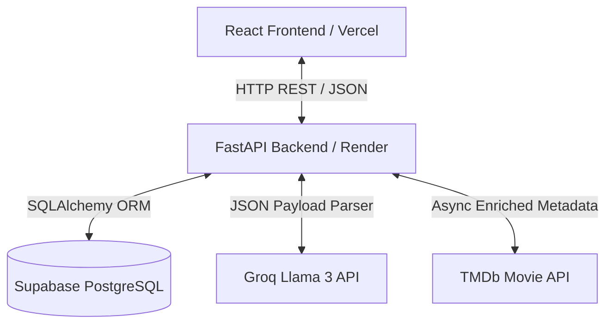
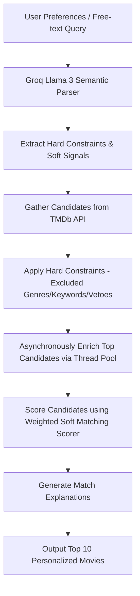

# 🎬 FilmRec: Movie Recommendation Engine

A modern web application that generates highly personalized movie recommendations for individuals (**Solo**) and room lobbies (**Group**) using the TMDb catalog and Groq Llama 3 semantic parsing.

🎥 **Live Demo:** [movie-rec-engine-rouge.vercel.app](https://movie-rec-engine-rouge.vercel.app)  
📖 **Backend API Docs:** [movie-rec-engine-backend.onrender.com/docs](https://movie-rec-engine-backend.onrender.com/docs)

---

## 📌 Project Overview
**FilmRec** bridges the gap between catalog browsing and active movie watching. By integrating semantic analysis of unstructured natural language preferences with a robust multi-user group matching engine, FilmRec allows individuals and rooms of friends or family to find the perfect movie to watch without endless scrolling or arguments.

### Key Features
* **Solo Recommendations:** Custom tailored movie matches based on user profiles, genre preferences, cast/crew selection, and runtime constraints.
* **Natural Language Processing:** Integrates Groq Llama 3 to parse free-text preferences (e.g., *"moody sci-fi with a twist from the 90s, no horror"*), automatically extracting structured filters.
* **Multiplayer Room Lobbies:** Real-time rooms created via unique invite codes where multiple users can join and combine preference profiles.
* **Veto Filtering:** A strict consensus system that eliminates any movie suggestion violating any single lobby member's hard constraints (e.g., if one user vetos "horror", all horror movies are removed from the room recommendations).
* **Consensus-Based Scorer:** Aggregates individual scores to present a weighted consensus recommendations list, complete with dynamic, readable matching explanations.

---

## 🎯 Problem Statement
In the streaming era, users suffer from two major friction points:
1. **Individual Choice Paralysis:** Users spend more time filtering database dropdowns or scrolling infinite carousels than watching actual content. Standard search algorithms are rigid and fail to capture "vibe" or context-based user prompts.
2. **Group Decision Deadlocks:** Getting a group of friends, couples, or family members to agree on a movie is notoriously difficult. Opposing genre preferences, varying age limits, and personal dislikes make group decision-making a trial-and-error process.

---

## ⚙️ Technology Stack
* **Frontend:** React, TypeScript, Vite, Tailwind CSS, Vanilla CSS
* **Backend:** FastAPI, Python, Uvicorn, SQLAlchemy
* **Database:** Supabase PostgreSQL
* **Migrations:** Alembic
* **External APIs & LLMs:** TMDb API (The Movie Database), Groq Cloud API (Llama 3 70B/8B parsing)
* **Hosting:** Vercel (Frontend), Render (Backend), Supabase Cloud (Database)

---

## 📐 Architecture Diagram
The following diagram illustrates the interaction between the frontend client, the FastAPI backend, the Supabase database, and external API integrations.



---

## 🧠 Recommendation Pipeline
The recommendation engine follows a structured multi-stage execution pipeline to generate custom lists:



### Execution Details:
1. **Semantic Extraction:** Groq Llama 3 parses the user's free-text request to classify constraints:
   * **Hard Constraints (Must/Exclude):** e.g., `must_genres = [Sci-Fi]`, `without_genres = [Horror]`.
   * **Soft Signals (Preferences):** Keywords, production companies, release years, cast, crew.
2. **Candidate Gathering:** Fetches initial lists from TMDb (matching genres, popular movies, or similar movies).
3. **Hard Filtering:** Filters out movies violating any constraints (e.g. eliminating vetoed genres or excluded companies). In group settings, hard constraints from **all** lobby members are combined.
4. **Parallel Enrichment:** Candidate movie IDs are sent in parallel via Python ThreadPoolExecutors to TMDb to fetch production companies, languages, country origins, and keywords.
5. **Weighted Scoring:** The scorer rates movies based on overlap matching:
   * **Cast/Crew Match:** High weight if preferred actors/directors are present.
   * **Keyword Matching:** Semantic overlap between user free-text topics and TMDb keywords.
   * **Genre Overlay:** Points for preferred genres.
   * **Normalizers:** Rating averages and popularity values are factored in.
6. **Explanations:** Generates natural text summaries for each recommendation (e.g., *"Recommended because it matches your interest in space exploration, stars Leonardo DiCaprio, and has high rating reviews."*).

---

## 🗄️ Database Schema Overview
FilmRec relies on five primary relational tables in PostgreSQL:

| Table | Entity | Key Attributes | Description |
| :--- | :--- | :--- | :--- |
| `users` | User Accounts | `user_id` (PK), `username`, `email`, `password_hash`, `favourite_movies` | Stores user credentials, profiles, and fallback top 4 favorite movies. |
| `preferences` | Preference Profiles | `pref_id` (PK), `user_id` (FK), `similar_movies`, `preferred_genres`, `preferred_cast`, `preferred_crew`, `free_text` | Stores custom genre, cast, crew lists, runtime boundaries, and free-text prompts. |
| `group_rooms` | Room Lobbies | `room_id` (PK), `host_id` (FK), `room_code` (Unique), `status` | Stores real-time sessions created by hosts to invite room members. |
| `group_members` | Room Membership | `room_id` (FK), `user_id` (FK), `pref_id` (FK) | Links users to rooms and allows selecting a specific preference profile for that room. |
| `user_favourites`| Curated Favorites | `id` (PK), `user_id` (FK), `type`, `item_id`, `name`, `meta` | Persistent list of favorite items (e.g. actors, directors, genres, or movies). |

---

## 🛠️ Setup Instructions

### Environment Variables
Create a `.env` file at the root of the project with the following configuration:

```env
# Database configuration (Supabase PostgreSQL URL)
DATABASE_URL=postgresql://<username>:<password>@<host>:<port>/<database>

# External APIs
TMDB_API_KEY=your_tmdb_api_key
GROQ_API_KEY=your_groq_api_key

# JWT Security
JWT_SECRET_KEY=your_jwt_secret_key
ACCESS_TOKEN_EXPIRE_MINUTES=1440
```

---

### Local Development

#### 1. Setup Backend
1. Navigate to the backend folder:
   ```bash
   cd backend
   ```
2. Create and activate a Python virtual environment:
   ```bash
   python -m venv .venv
   # On Windows:
   .venv\Scripts\activate
   # On macOS/Linux:
   source .venv/bin/activate
   ```
3. Install dependencies:
   ```bash
   pip install -r requirements.txt
   ```
4. Run database migrations using Alembic:
   ```bash
   alembic upgrade head
   ```
5. Launch the FastAPI development server:
   ```bash
   python -m uvicorn app.main:app --reload --port 8000
   ```
The backend API is now running locally at `http://localhost:8000`. You can view the swagger docs at `http://localhost:8000/docs`.

---

#### 2. Setup Frontend
1. Navigate to the frontend folder:
   ```bash
   cd ../frontend
   ```
2. Install npm packages:
   ```bash
   npm install
   ```
3. Run the frontend development server:
   ```bash
   npm run dev
   ```
Navigate to `http://localhost:5173` to open the web app!

---

## 🚀 Cloud Deployment

### 1. Database (Supabase)
* Provision a free PostgreSQL database on [Supabase](https://supabase.com).
* Retrieve the URI connection string from database settings.
* Set the connection string as `DATABASE_URL` in your backend environment configuration.

### 2. Backend (Render)
* Create a new Web Service on [Render](https://render.com) linking your GitHub repository.
* Set the Root Directory to `backend`.
* Configure the Build Command to: `pip install -r requirements.txt`
* Configure the Start Command to: `uvicorn app.main:app --host 0.0.0.0 --port $PORT`
* Insert your Environment Variables in the service settings dashboard.

### 3. Frontend (Vercel)
* Deploy the React project on [Vercel](https://vercel.com).
* Link your GitHub repository and set the Root Directory to `frontend`.
* Add the environment variable `VITE_API_BASE_URL` pointing to your Render Backend URL.
* Deploy!
